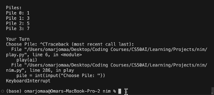

# Nim Game vs AI

## Description

This Python script is a game of Nim where the user plays against an AI. The AI utilizes reinforcement learning to refine its strategy through multiple self-play sessions. As it learns the optimal moves, the AI adapts and enhances its decision-making skills. Once trained, the AI is ready to face off against the user in a challenging game of Nim. With each move, the AI demonstrates the effectiveness of its learned strategies, providing an exciting and interactive experience for players.

## Visual

**AI training on 10,000 games then playing against user**

